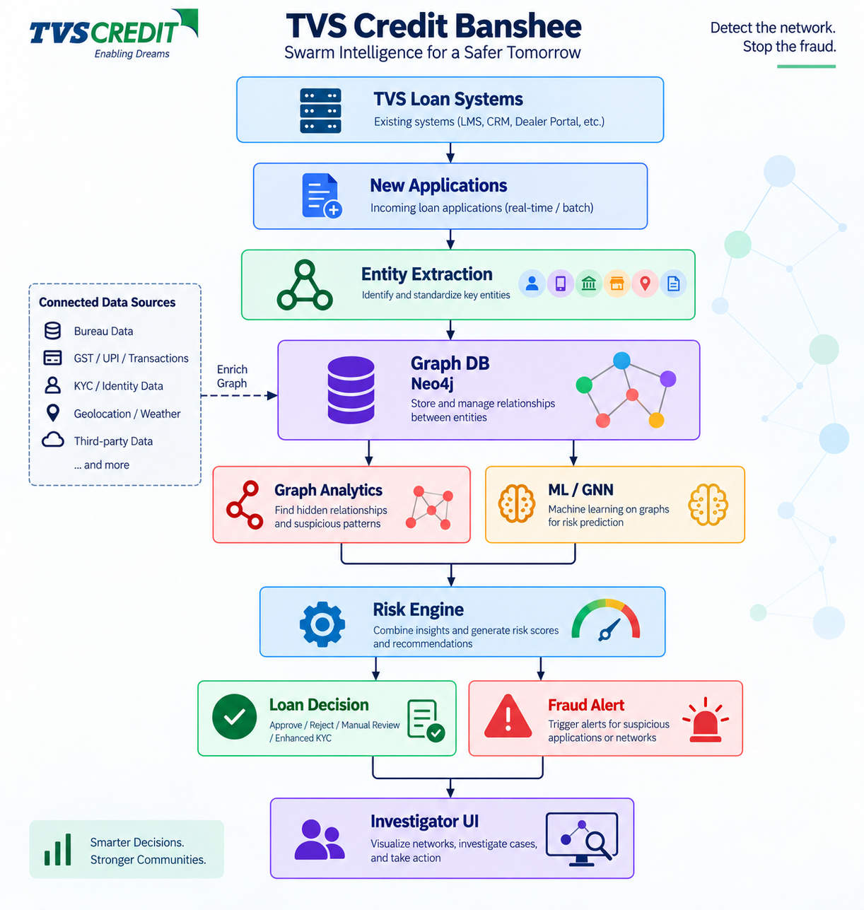
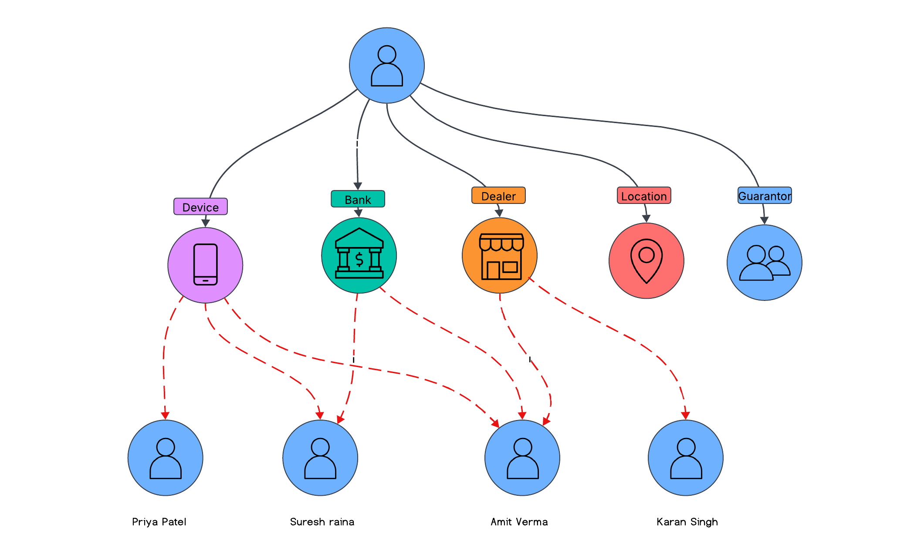

<p align="center">
  
</p>

<h1 align="center">TVS Credit Banshee</h1>
<h3 align="center">Swarm Intelligence Lending Network — AI-Driven Fraud Ecosystem Prediction</h3>

<p align="center">
  
  
  
  
  
  
</p>

---

## 📌 Executive Summary

Traditional retail lending models (XGBoost, Logistic Regression) score loan applications in **silos** as isolated rows in a database. In rural and semi-urban lending, fraudsters exploit this blind spot by operating in **organized syndicates**: colluding dealers, burner phone numbers, shared device emulators, mule bank accounts, and serial guarantors.

**TVS Credit Banshee** reimagines credit underwriting as a **collective nervous system (Swarm Intelligence)**. By modeling borrowers and entities in a dynamic, multi-relational heterogeneous graph, risk signals propagate across multi-hop connections—allowing TVS Credit to detect and quarantine **emerging fraud ecosystems before disbursal occurs**.

---

## 🌐 Relational Knowledge Graph Topology

<p align="center">
  
</p>

Every loan application connects to multiple operational and contextual entities. If an entity is tainted by historical defaults or fraudulent behavior, the risk naturally **swarms** to connected applicants:

| Entity Node | Relational Edge (`relation_*.csv`) | Syndicate Fraud Typology Caught |
| :--- | :--- | :--- |
| 📱 **Device** | `application <-> device_fingerprint` | **Emulator Farms & Bot Floods**: Multi-apply attacks executed from the same hardware/emulator. |
| 🏦 **Bank Account** | `application <-> bank_account_hash` | **Mule Account Rings**: Funneling multiple disbursed loans into common shell accounts. |
| 🏪 **Dealer** | `application <-> dealer_id` | **Dealer Collusion Syndicates**: Rogue vehicle/tractor dealerships fabricating ghost invoices for subventions. |
| 📍 **Location** | `application <-> pincode` | **Geo-Spatial Fraud Hotspots**: Micro-clusters of coordinated defaults across rural pin codes. |
| 👥 **Guarantor** | `application <-> guarantor_id` | **Serial Guarantor Fraud**: Influencers underwriting dozens of delinquent loans across branches. |
| 📞 **Mobile** | `application <-> mobile_hash` | **Burner SIM Networks**: Recycled contact numbers masking synthetic borrower identities. |

---

## ⚡ How It Works: The Dual-Engine Pipeline

```
  Loan Ingestion (LOS) ➔ Entity Extraction ➔ HeteroRGCN Neural Brain ➔ Risk Engine ➔ Loan Decision / Fraud Alert
```

1. **Entity Extraction & Graph DB**: Ingests incoming loan applications alongside bureau, KYC, and device telemetry into an in-memory graph (backed by Neo4j).
2. **The "Brain" (HeteroRGCN)**: A Heterogeneous Relational Graph Convolutional Network computes relation-specific message passing:
   $$h_v^{(l+1)} = \sigma \left( \sum_{r \in \mathcal{R}} \sum_{u \in \mathcal{N}_r(v)} \frac{1}{c_{v,r}} W_r^{(l)} h_u^{(l)} + W_0^{(l)} h_v^{(l)} \right)$$
   - **Target Nodes (`application_id`)**: Receive normalized tabular features (Income, LTV, CIBIL, EMI burden).
   - **Entity Nodes (Dealers, Devices, Banks)**: Receive trainable latent embeddings ($\mathcal{E} \in \mathbb{R}^{N \times d}$) updated via backpropagation.
3. **Graph Analytics & Ring Discovery**: Unsupervised community clustering groups high-dimensional graph embeddings to isolate multi-applicant syndicate rings.
4. **Automated Risk Engine & Gateway**:
   - **Risk Score $< 0.25$** ➔ **Straight-Through Processing (STP)** Instant Approval.
   - **$0.25 \le \text{Score} \le 0.65$** ➔ **Manual Underwriting**.
   - **Score $> 0.65$** ➔ **Syndicate Disbursal Hold** + Alert to Fraud Control Unit.
5. **Investigator UI**: Explains decisions using interactive 2-hop computational subgraphs showing exact paths to suspicious dealers or devices.

---

## 🚀 Quick Start

### 1. Setup Environment
```bash
# Clone the repository
git clone https://github.com/waittim/graph-fraud-detection.git
cd graph-fraud-detection

# Install dependencies
pip install torch dgl pandas numpy scikit-learn fastapi uvicorn python-pptx
```

### 2. Generate Synthetic TVS Credit Dataset
Creates realistic loan data (120 applicants across 2-Wheeler, Used Car, and Tractor products with embedded syndicate rings):
```bash
python3 generate_tvs_dummy_data.py
```
*Outputs generated into `./data/`: `features.csv`, `relation_dealer.csv`, `relation_device.csv`, `relation_bank.csv`, `tags.csv`, etc.*

### 3. Train the GNN Engine & Discover Fraud Rings
```bash
python3 train.py --target-ntype application_id --n-epochs 100 --lr 0.01
```
*Outputs saved into `./output/`: ROC/PR curves, training metrics, and detected syndicate clusters in `fraud_ecosystems.csv`.*

### 4. Start the Real-Time Scoring Microservice
```bash
uvicorn app_server:app --host 0.0.0.0 --port 8000 --reload
```
Test scoring an incoming application in real time ($<250\text{ms}$):
```bash
curl -X POST http://localhost:8000/api/v1/score_application \
  -H "Content-Type: application/json" \
  -d '{
    "application_id": "TVSC_APP_9901",
    "loan_amount": 85000.0,
    "asset_cost": 110000.0,
    "ltv_ratio": 0.7727,
    "bureau_score": 720.0,
    "applicant_age": 32,
    "monthly_income": 42000.0,
    "emi_to_income": 0.21,
    "downpayment_rate": 0.227,
    "dealer_id": "DLR_CORRUPT_04",
    "device_fingerprint": "DEV_EMULATOR_FARM_99",
    "bank_account_hash": "BANK_ACC_4492",
    "mobile_hash": "MOB_9841122334",
    "guarantor_id": "GUA_SERIAL_FRAUDSTER_01",
    "pincode": "PIN_620001"
  }'
```

---

## 📊 Business Impact for TVS Credit

* 📉 **32% – 40% Reduction in First Payment Defaults (FPD)** by catching syndicate applications prior to fund release.
* ⚡ **75% Straight-Through Processing (STP)** for clean borrowers with verifiable topological distance from known fraud clusters.
* 🛡️ **Autonomous Dealer Governance**: Real-time dealer risk indices dynamically updated without requiring manual quarterly audits.
* 🔍 **Full Underwriter Transparency**: Replaces black-box scores with visual subgraph evidence for compliance with RBI digital lending guidelines.

---

## 📁 Repository Structure

```
├── artifacts/
│   └── tvscredit_assests/             # High-res architecture & relationship diagrams
│       ├── architecture_network.png    # End-to-end system architecture banner
│       └── graph_realationships.png    # Multi-relational entity mapping
├── gnn/
│   ├── pytorch_model.py                # HeteroRGCN & HeteroRGCNLayer neural definitions
│   ├── graph_utils.py                  # DGL heterograph builder & relation parsing
│   ├── data.py                         # Data normalization, string ID indexing, masking
│   ├── estimator_fns.py                # Argument parsing & hyperparameter configuration
│   └── utils.py                        # Metrics calculation (ROC-AUC, PR-AUC, Confusion Matrix)
├── data/                               # Input features.csv, relation_*.csv, tags.csv
├── app_server.py                       # FastAPI real-time scoring microservice
├── train.py                            # End-to-end GNN training & ring detection entrypoint
├── generate_tvs_dummy_data.py          # Synthetic TVS Credit data generator
├── generate_presentation.py            # Automated 12-slide PowerPoint deck generator
├── TVS_Credit_EPIC8_Swarm_Intelligence_Lending_Network.pptx  # Round 2 Competition Deck
├── ARCHITECTURE_SWARM_LENDING.md       # Full mathematical & architectural specification
└── BACKEND_AND_API_GUIDE.md            # Enterprise API & backend deployment guide
```

---

<p align="center">
  <b>TVS Credit E.P.I.C 8 — IT Case Study (Problem Statement e)</b><br>
  <i>Smarter Decisions. Stronger Communities.</i>
</p>
